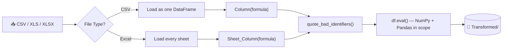

# 🧮 Dynamic Calculated Columns Engine
### Excel-Style Formula Columns for CSV & Excel — Built in Python

*Type `Profit(Revenue - Cost)` and get a new column back. No pipeline to edit, no notebook to rerun — just a formula.*


---

## 📊 At a Glance

| | | | |
|---|---|---|---|
| **3** file formats (CSV/XLS/XLSX) | **10+** built-in formula functions | **2** modes (single-sheet / multi-sheet) | **0** hardcoded columns — fully dynamic |

---

## 🎯 The Problem

Adding a derived column to a spreadsheet usually means one of two bad options: open Excel and hand-write formulas that no one can audit, or open a notebook and write throwaway pandas code for a one-time calculation. Neither scales, and neither leaves an easily repeatable process behind.

This tool gives analysts a **third option**: type the formula once, in plain language close to Excel syntax, against a CSV or Excel file, and get a clean, timestamped output with the new column already in place — with full support for arithmetic, conditionals, string logic, and date math.

---

## 🏗 Architecture



---

## 🔍 How It Works — Step by Step

**1. Input & Validation**
`run_etl()` prompts for a file path and accepts only `.csv`, `.xls`, `.xlsx`. It detects Excel vs. CSV mode up front, since the two paths need different formula syntax.

**2. Built-In Instruction Panel**
Before asking for formulas, the script prints a full syntax reference — arithmetic, comparisons, logical operators, string concatenation, NumPy math (`sqrt`, `power`, `log`, `log10`, `exp`, `abs`, `round`), conditional logic (`np.where`, `np.select`), and date arithmetic (`pd.to_datetime`) — so no external documentation is needed to use it.

**3. Definition Capture**
A REPL-style loop reads `Column(formula)` (CSV) or `Sheet_Column(formula)` (Excel) until the user types `done`. `parse_definition()` extracts the target name — and sheet, for Excel — plus the raw formula, validating the shape as it goes.

**4. Safe Identifier Resolution**
`quote_bad_identifiers()` finds every column reference in a formula that isn't a valid Python identifier (spaces, symbols, a leading digit) and wraps it in backticks so pandas' `eval()` can resolve it. Columns are matched **longest-name-first** with word-boundary regex, so `Sales` never gets partially matched inside `Sales Tax`.

**5. Formula Execution**
Each formula runs through `df.eval(formula, engine='python', local_dict={'np': np, 'pd': pd})` — meaning one expression can freely mix arithmetic, boolean logic, string concatenation, and NumPy/Pandas calls.

**6. Safety Checks**
An existing column with the same name triggers an explicit overwrite warning before it happens. An Excel sheet name that doesn't exist skips just that one definition — it doesn't abort the run.

**7. Output**
CSV in → `Transformed/transformed_<stem>_<timestamp>.csv`. Excel in → a single `.xlsx` with every original sheet preserved, new columns included.

---

## ⚙️ Engineering Highlights

- **Longest-match-first regex ordering** — prevents partial-name collisions between similarly named columns.
- **Word-boundary lookaround matching** — only whole identifiers get quoted, never substrings.
- **Per-definition fault isolation** — one bad formula or missing sheet doesn't stop the rest of the batch.
- **One formula, many capabilities** — arithmetic, boolean logic, string ops, and NumPy math all resolve in a single `eval()` call.

> **Note on `eval()`:** formulas run through pandas' `eval()` with NumPy and Pandas in scope, which is intentionally powerful. This is built for **trusted, interactive use** — an analyst typing their own formulas — not for accepting formulas from an untrusted or public-facing input.

---

## 🧠 Skills Demonstrated

| Feature in the Code | Skill It Proves |
|---|---|
| `quote_bad_identifiers()` | Advanced regex — lookaround, deterministic match ordering |
| `df.eval()` + `local_dict` | Dynamic expression evaluation / lightweight DSL design |
| `parse_definition()` | Input parsing & validation |
| `np.where` / `np.select` support | Vectorized conditional logic |
| Per-definition try/except | Fault-tolerant batch processing |
| Multi-sheet `ExcelFile` / `ExcelWriter` use | Practical pandas–Excel I/O |

---

## 💡 Sample Session

```
Enter the full path of the file (CSV, XLS, XLSX): C:\Users\RAJESH\OneDrive\Desktop\ETL\data
...
> Profit(Revenue - Cost)
> Margin(Profit / Revenue)
> HighValue(np.where(Revenue > 10000, 'Yes', 'No'))
> done

✅ Transformed CSV saved to: Transformed/transformed_sales_20260716_143210.csv
Columns in output: ['Revenue', 'Cost', 'Region', 'Profit', 'Margin', 'HighValue']
```

---

## 🛠 Tech Stack

`Python 3` · `Pandas` · `NumPy` · `re` (regex) · `pathlib`

---

## 🚀 Getting Started

```bash
pip install pandas numpy openpyxl xlrd
python Adding_Measures_Column.py
```

---

## 🗺 Roadmap

- [ ] Add a dry-run / formula validator before writing output
- [ ] Support saving and replaying a formula set from a config file
- [ ] Add non-interactive CLI flags for scripted/batch use
- [ ] Sandbox `eval()` further for untrusted-input scenarios

---

## 👤 Author


**Rajesh Keshri**

*Data Analyst*

Linkedin -https://www.linkedin.com/in/rajesh-keshri-144a0510b

GitHub -[https://github.com/raajeshhakeshri/ProjectVault/tree/master/Data%20Analytics/Data%20Tool/ETL_with%20Python](#)   
Connect @ -[Officialrajesh.info@gmail.com](#)

*If this project is useful or interesting, a ⭐ on the repo is always appreciated.*