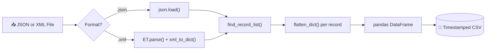

# 🧩 JSON & XML to CSV Normalizer
### Schema-Free Flattening for Semi-Structured Data — Built in Python

*Feed it a deeply nested JSON or XML file of any shape. It finds the records, flattens the structure, and hands back a clean CSV — no schema required.*


---

## 📊 At a Glance

| | | | |
|---|---|---|---|
| **2** formats unified (JSON + XML) | **1** shared engine for both | **∞** nesting depth supported | Batch **and** single-file modes |

---

## 🎯 The Problem

JSON and XML feeds rarely arrive flat. Records get buried three or four levels deep, sibling tags repeat inconsistently, and every source seems to nest things differently. Writing a bespoke parser per feed doesn't scale — and most teams end up with one flattening script per data source, each slightly different, each a little unreliable.

This tool solves it once: point it at a file (or a whole folder of them), and it **finds the repeating records on its own** — no schema, no config, no per-source script.

---

## 🏗 Architecture



---

## 🔍 How It Works — Step by Step

**1. Entry Point**
`main()` accepts a single file or a folder path. A folder is scanned for every `.json`/`.xml` file, and each is processed independently — one malformed file logs an error without stopping the rest.

**2. Parsing**
`json_to_csv()` loads JSON natively via the `json` module. `xml_to_csv()` parses XML with `ElementTree` and converts it into an equivalent dictionary via `xml_to_dict()` — attributes become `@attr` keys, and repeated sibling tags automatically fold into a list.

**3. Record Discovery**
`find_record_list()` recursively walks the parsed structure looking for the **first list of dictionaries**, wherever it sits in the nesting. The tool never needs to be told in advance where the "rows" are.

**4. Flattening**
`flatten_dict()` recursively collapses nested objects into `parent_key_child_key` columns. Lists of primitive values (e.g. `"tags": ["a","b"]`) become comma-separated strings; nested lists of objects are left for `find_record_list()` to handle as the actual record source.

**5. Graceful Fallback**
If no repeating record list exists anywhere in the document, the whole thing is flattened into a single-row DataFrame — so even a flat, config-style JSON/XML file still produces valid output instead of failing.

**6. Output**
Each result is saved as `<filename>_<YYYYMMDD_HHMMSS>.csv`, written with a UTF-8 BOM so it opens correctly (no mangled characters) directly in Excel, with a console preview of the first rows.

---

## ⚙️ Engineering Highlights

- **One engine, two formats** — `flatten_dict()` and `find_record_list()` power both the JSON and XML paths; no duplicated logic to keep in sync.
- **Schema-free by design** — works on arbitrarily deep nesting without a predefined structure or mapping file.
- **Faithful XML→dict mapping** — attributes, text content, and repeated child elements are all preserved, not just the plain text.
- **Batch fault isolation** — a folder of 50 files with 1 bad XML document still processes the other 49.

---

## 🧠 Skills Demonstrated

| Feature in the Code | Skill It Proves |
|---|---|
| `find_record_list()` | Recursive tree search / implicit schema inference |
| `flatten_dict()` | Recursive data-structure flattening |
| `xml_to_dict()` | XML→dict structural mapping, attribute handling |
| Shared pipeline for 2 formats | DRY design, format-agnostic engineering |
| Per-file try/except in batch mode | Defensive, fault-tolerant automation |

---

## 🔬 Sample Transformation

**Input JSON:**
```json
{
  "company": "Acme",
  "employees": [
    {"name": "Asha", "dept": {"code": "ENG"}},
    {"name": "Rohit", "dept": {"code": "OPS"}}
  ]
}
```

**Output CSV:**

| name | dept_code |
|---|---|
| Asha | ENG |
| Rohit | OPS |

`find_record_list()` locates the `employees` list automatically; `flatten_dict()` turns `dept.code` into `dept_code`.

---

## 🛠 Tech Stack

`Python 3` · `Pandas` · `xml.etree.ElementTree` · `json`

---

## 🚀 Getting Started

```bash
pip install pandas
python JSON_XML_to_CSV_Standalone.py
```

> **Before you run it:** `OUTPUT_DIRECTORY` near the top of the file is a hardcoded path. Update it to your own location — and if you're publishing this repo publicly, swap it for a relative path so a personal folder structure isn't exposed in the source.

---

## 🗺 Roadmap

- [ ] Replace the hardcoded `OUTPUT_DIRECTORY` with a CLI argument or config file
- [ ] Add column-order / schema preservation options
- [ ] Support JSON Lines (`.jsonl`) input
- [ ] Add pytest coverage for deeply nested edge cases

---

## 👤 Author

**Rajesh Keshri**

*Data Analyst*

Linkedin -https://www.linkedin.com/in/rajesh-keshri-144a0510b

GitHub -[https://github.com/raajeshhakeshri/ProjectVault/tree/master/Data%20Analytics/Data%20Tool/ETL_with%20Python](#)   
Connect @ -[Officialrajesh.info@gmail.com](#)

*If this project is useful or interesting, a ⭐ on the repo is always appreciated.*

