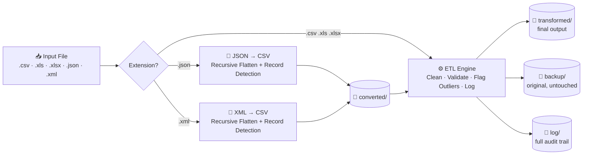

# 🔄  ETL Pipeline
### Multi-Format Data Ingestion, Cleansing & Governance Engine — Built in Python

*A single pipeline that takes in CSV, Excel, JSON, or XML — however messy — and hands back clean, validated, audit-logged data, without ever touching the original file.*


---

## 📊 At a Glance

| | | | | |
|---|---|---|---|---|
| **5** file formats unified | **59** governed business fields | **3** regulated ID formats validated | **IQR** statistical outlier detection | **100%** transformation audit trail |

---

## 📑 Table of Contents

1. [The Problem](#-the-problem)
2. [Architecture](#-architecture)
3. [How It Works — Step by Step](#-how-it-works--step-by-step)
4. [Engineering Highlights](#-engineering-highlights)
5. [Skills Demonstrated](#-skills-demonstrated)
6. [Sample Transformation](#-sample-transformation)
7. [Output Structure](#-output-structure)
8. [Tech Stack](#-tech-stack)
9. [Getting Started](#-getting-started)
10. [Roadmap](#-roadmap)
11. [Author](#-author)

---

## 🎯 The Problem

Real-world data is not always straightforward. It can appear as an uneven JSON export, an raw XML feed, an Excel spreadsheet with multiple naming conventions in a single column, or a CSV file where "N/A", "NA", and an empty cell are interpreted as three distinct values downstream despite meaning the same thing.

Most teams write **one-off scripts per format** — a JSON script here, a CSV script there — which means data quality logic gets duplicated, drifts out of sync, and nobody trusts the numbers.

This project solves that with **one pipeline, one set of rules, five input formats.** Whatever lands in the folder — `.csv`, `.xls`, `.xlsx`, `.json`, or `.xml` — comes out the other end normalized, validated, flagged for anomalies, and fully traceable back to its original state.

---

## 🏗 Architecture



Two formats, one destination: JSON and XML are normalized into CSV *first*, then routed into the **same** ETL engine that CSV/Excel files use directly. One rule set, zero duplicated logic.

---

## 🔍 How It Works — Step by Step

**1. Entry & Routing — `main()` → `process_file()`**
Accepts a single file or an entire folder. Each file is dispatched by extension — no manual sorting required, and one bad file in a batch never kills the run (each file is wrapped in its own error handler).

**2. Format Normalization — `json_to_csv()` / `xml_to_csv()`**
JSON is parsed with the standard library `json` module; XML is parsed with `xml.etree.ElementTree` and converted into an equivalent nested-dictionary structure via `xml_to_dict()`. From this point, both formats are handled identically.

**3. Structural Flattening — `flatten_dict()` + `find_record_list()`**
Nested objects are recursively flattened into flat `parent_key_child_key` columns. A custom heuristic, `find_record_list()`, automatically locates the first repeating list of records inside an arbitrarily nested structure — so the pipeline doesn't need to be told where the "rows" are; it finds them.

**4. The ETL Core — `convert_file()`**
Loads the (now-CSV) data with Pandas, orchestrates the full cleaning pass, and manages every output: the transformed result, the pre-transformation backup, and the run log — each to its own dedicated folder.

**5. Cleaning & Validation — `transform_dataframe()`**
The heart of the pipeline. Column headers are stripped of special characters and proper-cased. Every string column is scanned for invisible Unicode characters (zero-width spaces, BOMs, non-breaking spaces), trimmed, and whitespace-collapsed. Six null-token variants (`NA`, `N/A`, `NULL`, `-`, etc.) are standardized to true nulls. 59 pre-configured business-critical fields (IDs, codes, statuses) are uppercased and — where a pattern exists — validated against regex rules for regulated identifiers like **PAN**, **GSTIN**, and **IFSC**.

**6. Integrity & Anomaly Checks**
Complete duplicate rows are detected and removed; duplicate columns are flagged. Negative values in `age`, `salary`, `quantity`, and `price` fields are surfaced. Delivery dates earlier than order dates are caught automatically. Sequential numeric columns (e.g. ID series) are conditionally forward/backward-filled — but *only* when ≥90% of the column behaves like a true series, so genuinely sparse data is never silently patched.

**7. Statistical Outlier Detection**
Every numeric column gets IQR-based (Tukey's fences) outlier detection, with a same-row `_OutlierFlag` column inserted directly beside the source column — enriching the data non-destructively rather than deleting anything.

**8. Multi-Destination Output**
Every run produces four artifacts: the untouched original in `backup/`, the cleaned result in `transformed/`, the JSON/XML intermediate in `converted/` (where applicable), and a line-by-line, timestamped audit log in `log/`.

---

## ⚙️ Engineering Highlights

- **Backup-before-mutate discipline** — the original data is written to `backup/` straight from the source, never from the transformed copy, so it's never at risk of corruption by the cleaning logic.
- **Config-driven, not hardcoded** — the 59 governed columns, null tokens, and regex rules all live in a single `CONFIG` dictionary, so extending coverage means editing data, not code.
- **Non-destructive enrichment** — outlier flags and validation results are *added* alongside the data, never overwriting the source value.
- **Full data lineage** — every value that changes is logged with its sheet, row, column, original value, transformed value, and validation outcome.
- **Defensive by default** — every risky operation (date parsing, regex matching, numeric coercion) is wrapped so a single malformed cell can't crash a multi-thousand-row batch.

---

## 🧠 Skills Demonstrated

| Feature in the Code | Skill It Proves |
|---|---|
| 5-format ingestion router (`process_file`) | ETL / ELT pipeline design |
| `flatten_dict`, `find_record_list` | Recursive algorithms on semi-structured data |
| Regex validation for PAN / GSTIN / IFSC | Regulatory & compliance-aware data engineering |
| IQR outlier detection | Applied statistics |
| Conditional forward/backward fill | Judgment-based imputation, not blind automation |
| Timestamped, multi-folder output structure | File system orchestration & naming conventions |
| Row/column-level audit logging | Data lineage & observability |
| Try/except isolation per file | Defensive programming, fault-tolerant batch jobs |
| Single `CONFIG` dict driving all rules | Config-driven, maintainable architecture |
| Modular, single-responsibility functions | Clean code & readability |

---

## 🔬 Sample Transformation

| Field | Raw Input | Cleaned Output |
|---|---|---|
| Country Code | `" in "` | `IN` |
| Customer ID | `cust_00123` | `CUST_00123` |
| Status | `n/a` | *(standardized to NULL)* |
| Age | `-5` | `-5` *(kept, flagged as invalid in the log)* |
| Revenue | `184200` | `184200` → `_OutlierFlag: Outlier` *(if outside 1.5×IQR)* |

---

## 📁 Output Structure

```
ETL_OUTPUT/
├── Converted/       # Raw CSV produced from JSON/XML input
├── Backup/          # Original, pre-transformation data — untouched
├── Transformed/     # Final, cleaned, validated output
└── Log/             # log_<filename>_<timestamp>.txt — full audit trail
```

---

## 🛠 Tech Stack

`Python 3` · `Pandas` · `XlsxWriter` · `re` (regex) · `json` · `xml.etree.ElementTree` · `datetime`

---

## 🚀 Getting Started

```bash
pip install pandas xlsxwriter openpyxl xlrd
python Unified_ETL_Pipeline.py
```

You'll be prompted for a file **or folder** path — mixed formats in the same folder are handled automatically:

```
Enter the path of the CSV/XLS/XLSX/JSON/XML file OR a folder containing files:
> C:\Data\incoming_batch
```

---

## 🗺 Roadmap

- [ ] Externalize `CONFIG` into a YAML/JSON file for non-technical rule updates
- [ ] Add a pytest suite covering `flatten_dict`, `find_record_list`, and outlier detection
- [ ] Parameterize hardcoded output paths via CLI args / `argparse`
- [ ] Package as a CLI tool (`pip install`-able)
- [ ] Add a lightweight HTML summary report alongside the text log

---

## 👤 Author


**Rajesh Keshri**

*Data Analyst*

Linkedin -https://www.linkedin.com/in/rajesh-keshri-144a0510b

GitHub -[https://github.com/raajeshhakeshri/ProjectVault/tree/master/Data%20Analytics/Data%20Tool/ETL_with%20Python](#)   
Connect @ -[Officialrajesh.info@gmail.com](#)

*If this project is useful or interesting, a ⭐ on the repo is always appreciated.*